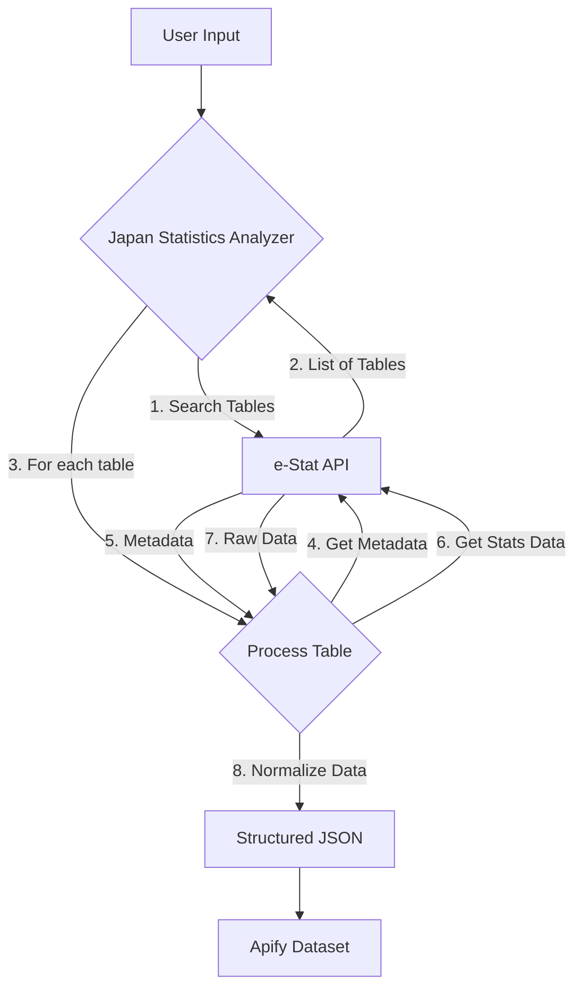

# Japan Government Statistics Analyzer


> Your comprehensive gateway to Japan's official government statistics. Extract, normalize, and analyze a vast range of data from the e-Stat API for market research, economic analysis, and academic studies.

This Apify Actor provides a powerful and easy-to-use interface to access the rich dataset provided by the **e-Stat API**, the official portal for Japanese government statistics. It automates the process of searching, fetching, and normalizing complex statistical data, making it immediately available for your analysis pipelines.

## How It Works

The Actor follows a systematic process to deliver clean and structured data:



1.  **Search Tables**: The Actor queries the e-Stat API with your specified keywords, survey years, or statistical fields to find relevant data tables.
2.  **Retrieve Metadata**: For each table found, it fetches detailed metadata, including category definitions, units, and survey information.
3.  **Fetch Statistical Data**: The Actor then retrieves the core statistical data from each table.
4.  **Normalize and Structure**: The raw data is transformed into a clean, easy-to-use JSON format. This process includes mapping codes to human-readable names and structuring the data logically.
5.  **Deliver Results**: The final structured data, along with raw data and metadata (if requested), is pushed to the Apify Dataset for you to download or use in other Actors.

## Key Features

-   **Comprehensive Data Access**: Tap into a wide array of official statistics, including population census, economic indicators, labor force surveys, and more.
-   **Flexible Search**: Pinpoint the exact data you need using keywords, survey years, and official statistical field codes.
-   **Dual Output Format**: Choose between clean, normalized **structured JSON** for easy analysis, **raw JSON** for full detail, or **both**.
-   **Demo Mode**: Run the Actor without an API key to see sample data and understand its capabilities. Perfect for evaluation.
-   **Robust Error Handling**: Automatically handles common API errors and provides clear feedback.
-   **Built-in Rate Limiting**: Respects API usage limits with a built-in delay between requests to ensure reliable operation.

## Getting Started

### Demo Mode (No API Key)

To test the Actor, simply run it with the default input settings. It will operate in **Demo Mode** and produce a small set of sample data, allowing you to inspect the output format and features.

### Full Access (e-Stat API Key)

For full access to the e-Stat database, you need a free Application ID:

1.  **Register**: Go to the [e-Stat API Registration Page](https://www.e-stat.go.jp/api/) and create a free account.
2.  **Get API Key**: Once registered, you will receive an `appId` (Application ID).
3.  **Set Environment Variable**: In your Apify account's secret environment variables, create a new variable named `ESTAT_APP_ID` and set its value to your `appId`.

The Actor will automatically use this key for all subsequent runs.

## Input Configuration

Provide your search criteria using a JSON object. Below are the available parameters and examples.

| Parameter | Type | Description | Default |
|-----------|------|-------------|---------|
| `searchKeyword` | String | Search term for statistical tables (e.g., "人口", "経済", "労働"). Use Japanese for best results. | `""` |
| `surveyYears` | String | Filter by specific survey years. Can be a single year ("2020") or a range ("2019-2021"). | `""` |
| `statsField` | String | A specific statistical field code for fine-grained filtering. | `""` |
| `maxItems` | Number | Maximum number of statistical tables to process. Range: 1-100. | `10` |
| `includeMetadata` | Boolean | If `true`, includes a detailed metadata object for each data point. | `true` |
| `outputFormat` | String | Output format. Options: `"structured"`, `"raw"`, or `"both"`. | `"structured"` |

### Example: Basic Population Search

This input will search for the 5 most recent population-related statistical tables.

```json
{
  "searchKeyword": "人口",
  "maxItems": 5
}
```

### Example: Advanced Economic Search

This input searches for GDP data from the year 2022 and requests both the raw and structured output.

```json
{
  "searchKeyword": "国内総生産",
  "surveyYears": "2022",
  "maxItems": 1,
  "outputFormat": "both"
}
```

## Output Data

The Actor outputs data in a structured JSON format, designed for easy analysis.

| Field | Type | Description |
|---|---|---|
| `statName` | String | The official name of the statistic (e.g., "国勢調査 人口総数"). |
| `surveyDate` | String | The date or period of the survey (e.g., "2020年"). |
| `region` | String | The geographical area the data pertains to (e.g., "全国" for 'All Japan'). |
| `category1` | String | The primary data category. |
| `category2` | String | A secondary data category for more detailed classification. |
| `value` | Number | The statistical value. |
| `unit` | String | The unit of measurement (e.g., "人" for 'people', "円" for 'yen'). |
| `sourceTableId` | String | The unique ID of the source table in the e-Stat database. |
| `dataType` | String | An inferred data type for easier filtering (e.g., `population`, `economic`). |
| `lastUpdated` | String | The date the source data was last updated, in ISO 8601 format. |
| `metadata` | Object | A comprehensive object containing detailed metadata (if `includeMetadata` is `true`). |
| `extractedAt` | String | The timestamp when the data was extracted, in ISO 8601 format. |

### Sample Output Record

```json
{
  "statName": "国勢調査 人口総数",
  "surveyDate": "2020年",
  "region": "全国",
  "category1": "総人口",
  "category2": "男女計",
  "value": 125836021,
  "unit": "人",
  "sourceTableId": "0003448738",
  "dataType": "population",
  "lastUpdated": "2021-06-25T00:00:00Z",
  "metadata": {
    "tableTitle": "国勢調査 人口総数",
    "categories": {
      "area": "全国",
      "gender": "男女計"
    }
  },
  "extractedAt": "2025-09-18T12:00:43.317Z"
}
```

## Disclaimer

This Actor is an independent tool and is not affiliated with the Japanese government or the e-Stat portal. It is designed to respect the e-Stat API's terms of service by implementing rate limiting. Users are responsible for ensuring their use case complies with the API's usage guidelines, especially for commercial purposes.

